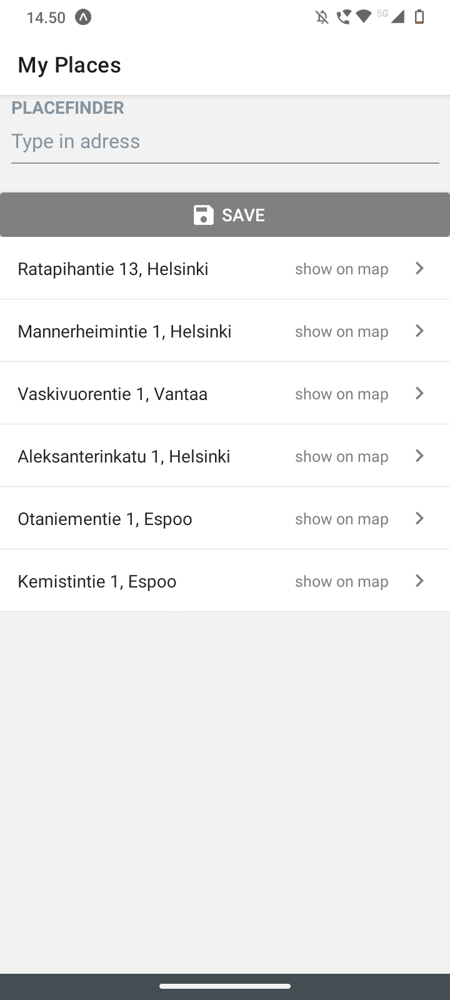
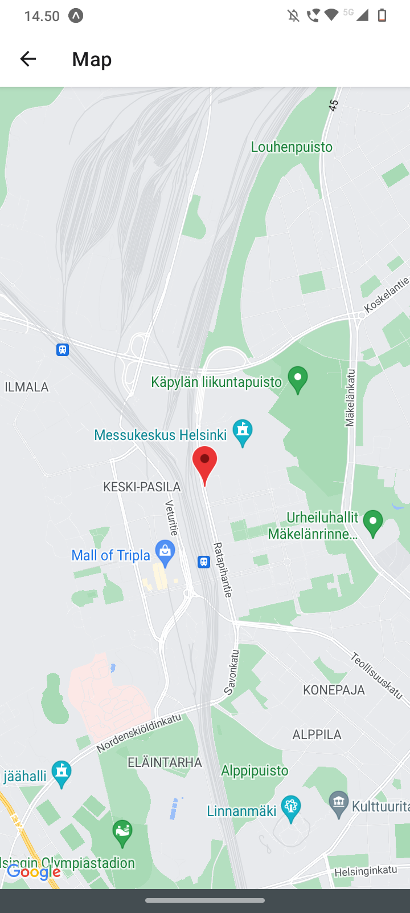

<h1>MyPlaces</h1>

MyPlaces is a simple address storing and finding app utilizing the [MapQuest](https://developer.mapquest.com/) API to fetch location data.

<h2>Project specifications</h2>
This project ulitizes the following technologies:

- [SQLite](https://www.sqlite.org/index.html)
- [React Native Elements](https://reactnativeelements.com/)
- [React Navigation](https://reactnavigation.org/)

<h2>Views</h2>

Here's the main page where the user can search/save addresses and save them to their list.

When pressing the list item the app will open a map showing the location of the address:

Items are deleted from the list by holding down on the item.

Thanks for checking out my project!
